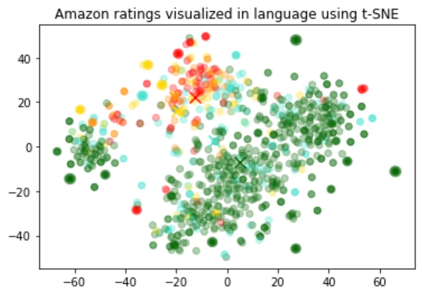
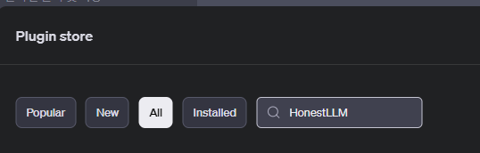
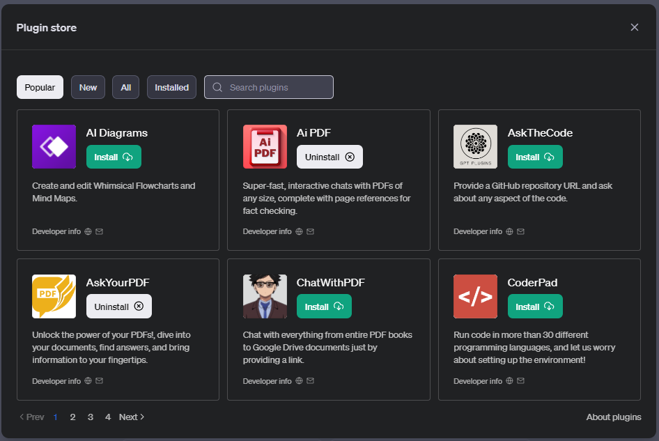

# HonestLLM

#### Problems
Recently, generative language models (GPT, Bing, etc.) have been generating
hallucinations.
The source of the problem may be in the model's parameters or training method, but it's
difficult to fix it immediately.
So we saw a need for a tool that would allow users to verify the accuracy of model answers
and provide information about the reason behind them.


#### Why news article?
We couldn't realistically apply it to all domains.
Therefore, we made sure that LLM could respond correctly to recent Korean news articles.


#### Embedding
Embed user input and match it against a news article.Calculate the similarity between the user's question and the article through embedding. 



https://platform.openai.com/docs/guides/embeddings/limitations-risks

#### naver news api

Using the NAVER News API, you can select articles that are most similar to the user's question and have a conversation with LLM based on that.


This way, you can expect an answer based on accurate evidence.

HonestLLM gives you the experience of having a trendy conversation with an LLM.


## Mission Statement
We are starting the HonestLLM open-source project.
The goal of the project is to develop technologies to determine the authenticity of the output
of AI models and to prevent hallucinations. Users will be able to visually check the reliability
of their answers using a fact-based database.
Through this, we will create a safe and reliable artificial intelligence environment and a more
certain and advanced future.

## Installation
system requirements

Python 3.8 or later

macOS, Windows are supported.

#### GPT Plugin
To get to the Chat GPT plugin, search for it in the following search bar.


#### Local
To use it in your local environment, please obtain an API key from the site below.
* openai api :


https://platform.openai.com/api-keys
* naver news api :


https://developers.naver.com/docs/serviceapi/search/news/news.md


## Usage

#### in plugin
It is waiting to be reviewed in the OPEN AI waitlist.




#### in local
In Local environment, it utilizes the API KEY you were issued.

Then, using our code, we can see the appropriate output for the user's question.

#### Example
##### input
For example, you might ask for recent news stories about Heung Min Son.
```python
answer = generate_answer('손흥민의 최근 뉴스들을 알려줘')
```


##### output
HonestLLM extracts keywords from user questions and informs you about them based on recent news. 
```python
answer
손흥민 선수에 관한 최근 뉴스에는 다음과 같은 내용이 포함되어 있습니다:

1. 주장으로서의 역할: 영국 매체 'TBR 풋볼'에 따르면, 엔제 포스테코글루 감독은 이번 시즌을 앞두고 손흥민 선수를 토트넘의 새로운 주장으로 임명하였습니다. 손흥민 선수는 주장으로서 첫 연설을 할 때 크게 긴장했다고 말했으며, 이는 그가 경험한 가장 긴장된 순간 중 하나였습니다.

2. 팀의 분위기 변화: 토트넘에서 주장이 된 이후, 손흥민 선수는 선수들을 하나로 뭉치게 하는 리더십을 발휘하고 있습니다. 경기장 밖에서도 선수들과 좋은 관계를 유지하며 좋은 경기력을 선보이고 있습니다. 이로 인해 토트넘은 시즌 초반 좋은 흐름을 타고 있지만, 최근에는 리그 2연패에 빠졌으며 승점 26으로 4위에 위치해 있습니다.

이 외에도, 토트넘은 현재 공격수 부문에서 변화가 있을 수 있는 상황에 놓여있습니다. 특히 히샬리송 선수가 사우디아라비아로 이적할 가능성이 언급되며, 토트넘은 새로운 공격수 영입을 고려하고 있는 상황입니다.

손흥민 선수 개인적으로는 토트넘에서 중요한 역할을 수행하고 있으며, 새로운 주장으로서 팀의 통합과 성과 향상을 위해 중요한 역할을 하고 있다는 점이 강조되고 있습니다.
```


## Licenses

  
Apache License 2.0  


## Authors

18011093 황성태  

18011543 박지환  

19010976 김민재  

19012022 홍석주  


## 
