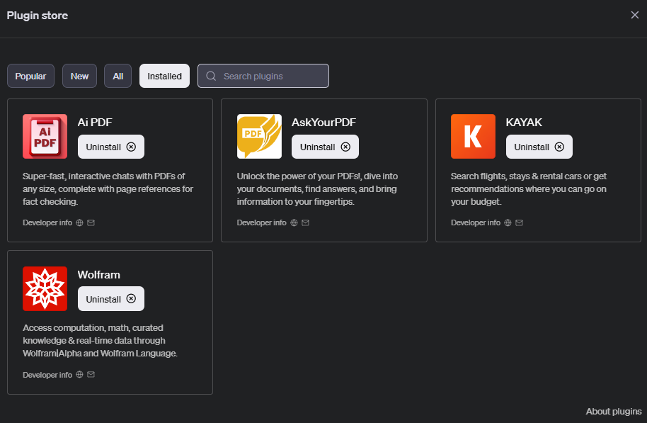

==============
Getting Started Installation
==============

system requirements

- Python 3.8 or later
- macOS, Windows are supported.

GPT plugin
=========================
Installation Process:
1. Go to openai GPT web store

.. image:: source/images/install1.png
   :width: 400

2. Locate and select the extension you want to install

.. image:: docs/source/images/install2.png
   :width: 400

3. Click Add to GPT

Local
===============================
Installation Process:
1. It can work in a Python environment.

2. Installation Requirements
